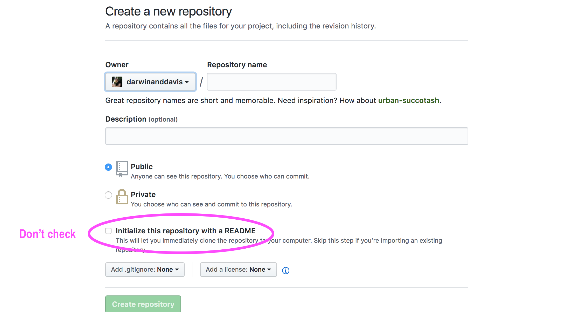

```{r, set-options, echo = FALSE, cache = FALSE}
options(width=100)
knitr::opts_chunk$set(
 eval = F, # run all code
 # echo = FALSE, # show code chunks in output 
 comment = "",
 tidy.opts=list(width.cutoff=100), # set width of code chunks in output
 tidy=TRUE, # make output as tidy
 message = FALSE,  # mask all messages
 warning = FALSE, # mask all warnings 
 size="small" # set code chunk size
)

# https://github.com/ucb-stat133/stat133-fall-2016/blob/master/hws/hw02-tables-ggplot.Rmd
knitr::opts_knit$set(root.dir=paste0(params$dir,"/")) # set working dir

setwd(paste0(params$dir,"/")) # for running just in R not knitr
```

<!-- adding footnote capabilities in ioslides (https://stackoverflow.com/questions/42690955/how-to-insert-footnotes-in-ioslides-presentations-using-rmarkdown ) -->
<style>
div.footnotes {
  position: absolute;
  bottom: 0;
  margin-bottom: 10px;
  width: 80%;
  font-size: 0.6em;
}
</style>

<script src="https://ajax.googleapis.com/ajax/libs/jquery/3.1.1/jquery.min.js"></script>
<script>
$(document).ready(function() {
  $('slide:not(.backdrop):not(.title-slide)').append('<div class=\"footnotes\">');

  $('footnote').each(function(index) {
    var text  = $(this).html();
    var fnNum = (index+1).toString();
    $(this).html(fnNum.sup());

    var footnote   = fnNum + '. ' + text + '<br/>';
    var oldContent = $(this).parents('slide').children('div.footnotes').html();
    var newContent = oldContent + footnote;
    $(this).parents('slide').children('div.footnotes').html(newContent);
  });
});
</script> 
<!-- end footnote capabilities in ioslides -->
<!-- Useage: Some text.<footnote>A *footnote* with **formatting**</footnote> -->

<!-- ____________________________________________________________________ -->
<!-- _____________________________ BODY ________________________________ -->

## What the hell is Github? | And git {.build}       

### Version control system for data  

### Logs commits of file changes retrievable at any time  

<!-- ----------------------- image --------------------------- -->
<div align="right">
  
</div>
<!-- ----------------------- image --------------------------- -->

<!-- _____________________________ break ________________________________ -->
## Applications {.build}  

### **Version control**  

### Collaborate  

### Storage for every possible file type, e.g. Supp Material    

### Dynamic loading of stored links and programs  

```{bash echo=T, eval=F}
require(RCurl)
script <- getURL("https://raw.githubusercontent.com/darwinanddavis")
eval(parse(text = script))
```


### **Fork and clone a plethora of public data, code, material**    

<!-- _____________________________ break ________________________________ -->
## But why? {.build}  

### Reproducible    
### Unlimited    
### Transparent      
### Shareable    

<!-- _____________________________ break ________________________________ -->
## Best practice for git prep {.build}  

### Avoid spaces and CamelCase  
- e.g. 'my data.csv', 'My Data.csv' `POOR`  
- e.g. 'mydata.csv', 'my_data.csv' `GOOD`  

### Annotation    
```{r}
p <- rep(rnorm(100),20) # this is well annotated code  
```
### _Tab_ is your friend  

<!-- _____________________________ break ________________________________ -->
## Useful syntax {.build}     

`cd` change working dir. `cd ..` move one level up   

`pwd` print current working dir    

`ls` list files in working dir    

`mkdir newfolder` make new working dir  

`touch text.txt` create new file   

<!-- _____________________________ break ________________________________ -->
## More useful syntax {.build}    
`cp source destination`    
copy files from _source_ to _destination_. e.g. cp /Users/mydir/README.txt ~/Documents  

`cp -R source destination`  
copy all folders, subfolders, and files from _source_ to _destination_  

`mv source destination`  
move files or folders from _source_ to _destination_ (no need for `-R`)  

`cp ~/Desktop/*.rtf ~/Documents`  
move multiple files with the * wildcard, which copies all .rtf files. The tilde (~) symbol is a shortcut for your Home folder, which contains '/Desktop'.    

`mv ~/Desktop/MyFile.rtf ~/Desktop/MyFile-old.rtf`  
`cp ~/Desktop/MyFile.rtf ~/Documents/MyFile-old.rtf`  
rename files    

<!-- _____________________________ break ________________________________ -->
# Let's git it    

<!-- _____________________________ break ________________________________ -->
## Initialising and using your repo {.build}  

### **1. Create a repo**  
### **2. Create and stage your files**  
#### - `add` and `commit` your files  
### **3. Push to a remote github repo**  
#### - `push` your files

<!-- _____________________________ break ________________________________ -->
## 1. Create a repo {.build}     
Open _Terminal/cmd_     
```{bash eval=F, echo=T}
cd ~/Documents/ # change working dir     
ls # list dir contents      
``` 

Open _Finder/Windows_. Make a new project on your local comp.
```{bash eval=F, echo=T}
# create new project  
### <b> 
cd ~/Documents
### </b>
# create new file 
### <b> 
touch test.txt  
open test.txt  
### </b> 
# make a new folder  
### <b> 
mkdir newgit  
### </b>
# navigate to that folder  
### <b>
cd newgit
ls -a  
### </b>   
```

<!-- _____________________________ break ________________________________ -->  
## 1. Create a repo (cont ...) {.build}     

Create a new file in the command line       
```{bash eval=F, echo=T}
# navigate to your new git repo  
### <b>
pwd  
cd ~/Documents/newgit
### </b> 

# move the new file into the git repo      
### <b> 
mv ~/Documents/test.txt ~/Documents/newgit
ls  
### </b> 
```

**Initialise your new local repo**
```{bash eval=F, echo=T}
# init git
### <b> 
git init  
### </b> 
```

<!-- _____________________________ break ________________________________ -->
## 2. Create and stage your files {.build}    

Add the files in your folder to the local git repo    
```{bash eval=F, echo=T}  
# add the files to the git  
### <b> 
git add . # the '.' adds everything 
### </b>   
git add test.txt # adds individual files  
git status # check what git is doing   
```

Stage the files for the commit 
```{bash eval=F, echo=T}  
# add the files to the git  
### <b> 
git commit -m 'init commit' # -m adds a message  
### </b> 
```

### We've now added and staged files to a local repo. **Version control!**    

Let's check the changes  
```{bash eval=F, echo=T}
### <b> 
git log # recent git activity
### </b> 
```

<!-- _____________________________ break ________________________________ -->
## 3. Push to a remote github repo {.build}    

Now we push the changes we made from our local repo to our Github cloud.  

1. Create a new Github repo. Name is using best practise, e.g. no spaces   
2. Don't create a README
  - **Uncheck the box 'Initialise this Github with a README'**

<!-- ----------------------- image --------------------------- -->
<div align="right">
  
</div>
<!-- ----------------------- image --------------------------- -->

<!-- _____________________________ break ________________________________ -->
## 3. Push to a remote github repo (cont ...) {.build}    

First, copy the Github repo link you want to push to. Select either **https** or **SSH** (requires key access).        

<!-- ----------------------- image --------------------------- -->
<div align="center">
  
</div>
<!-- ----------------------- image --------------------------- -->

<!-- _____________________________ break ________________________________ -->
## 3. Push to a remote github repo (cont ...) {.build}  

Then push your staged (`commit`) files from your local repo to the remote repo  
```{bash eval=F, echo=T}  
# set the new remote repo
### <b>
git remote set-url origin "your github repo"  
### </b>
# see what remote repo you have
### <b>
git remote -v  
### </b>
# push changes from local repo to remote repo 
### <b>
git push -u origin master
### </b>
```

<!-- _____________________________ break ________________________________ -->
# That's it! | Your data is now stored and version controlled <br> in local and remote repos    

<!-- _____________________________ break ________________________________ -->
## Troubleshooting for previous steps  

**fatal: remote origin already exists**  
The remote origin already exists, so you can't add it again
```{bash eval=F, echo=T}  
git remote rm origin # if origin already exists, remove it
git remote add origin "your github repo" # then re-add 
git push origin master # then push again  
```

**! [rejected] master -> master (non-fast-forward)**
Someone else has made changes since your latest ones and git refuses to lose the commit, so won't push your new changes  
```{bash eval=F, echo=T}  
git pull origin master # fetches any updates to online repo and merges them    
```

**fatal: refusing to merge unrelated histories**
Usually associated with a README file on the Github repo  
```{bash eval=F, echo=T}  
git pull origin master --allow-unrelated-histories # unnecessary parallel history 
# merged to your project. usually associated with a README.md file
```
If VIM opens, type 'SHIFT + :', then press ENTER  

<!-- _____________________________ break ________________________________ -->
# Cloning an existing repo {.flexbox .vcenter}   

<!-- _____________________________ break ________________________________ -->
## Clone a remote repo to your local computer {.build}

This creates a git repository on your local machine complete with version control.  

Every version of every file for the history of the project is grabbed by default when you run `git clone`.  
```{bash echo=T, eval=F}
git clone "github url" "new repo name (optional)"
# e.g. git clone https://github.com/darwinanddavis/UsefulCode mynewrepo 
```

<!-- _____________________________ break ________________________________ -->
## Why clone? {.flexbox .vcenter .build}  

### You can dump the contents of any public repo, including its complete version history, onto your own computer, then upload it onto the cloud.

<div align="right">
  
</div>

<!-- _____________________________ break ________________________________ -->
## The short version {.build}    

### local git (version control on your comp)  
```{bash eval=F, echo=T}
git init # initialise your local git  
git add . # adds all files to git. replace '.' with filename for individ files
git commit -m 'redo intro' # '-m' = message 
```

### remote git (version control on your github)  
```{bash eval=F, echo=T}
# after the above steps ^ 
# see what remote repo you have. if a github one exists, you can just push
git remote -v  
# set the new remote repo (if necessary)  
git remote add origin "your github repo"  # if remote branch doesn't exist
git remote set-url origin "your github repo"  # if already exists
# push changes from local repo to remote repo 
git push -u origin master
```

### **If in doubt, ask the internet**  

<!-- _____________________________ break ________________________________ -->
# Troubleshooting  

<!-- _____________________________ break ________________________________ -->
## Staging and pushing files {.build} 

Re-do a commit    

```{bash eval=F, echo=T}
git reset --soft HEAD~1
```

Alternative push option 
```{bash eval=F, echo=T}
# option 1
git remote set-url origin "link to existing github repo" # talk to github 
git push -u origin master
# option 2
git remote add github "your github repo"  # if remote branch doesn't exist
git push -u github master
```

<!-- _____________________________ break ________________________________ -->
## Staging and pushing files (cont ...) {.build} 

After pushing to your remote repo and this error appears:  
` ! [rejected] master -> master (fetch first)`
```{bash eval=F, echo=T}   
git fetch origin master # match the local repo commit status to the push destination     
git merge master # merge the recent commits    
git push -u origin master # push to remote repo  

# for non-fast-forward error  
git fetch origin master:tmp
git rebase tmp
git push origin HEAD:master
git branch -D tmp
git push -u origin master 
```

<!-- _____________________________ break ________________________________ -->
## Staging and pushing files (cont ...) {.build} 

For `fatal: refusing to merge unrelated histories` error  
```{bash eval=F, echo=T}   
git checkout master
git merge origin/master --allow-unrelated-histories
# or run this before your 'git pull origin master' command  
git pull --allow-unrelated-histories origin master 
```

Delete files from a Github repo
```{bash eval=T, echo=T}
# ensure you are in the default branch:
git checkout master
# the rm -r command will recursively remove your folder:
git rm -r folder-name
#Commit the change:
git commit -m "Remove duplicated directory"
# push the change to your remote repo
git push origin master
```

<!-- _____________________________ break ________________________________ -->
## Accessibility  {.build}  

If Github questions your user credentials.    

```{bash eval=F, echo=T}
git config --global user.email "<your email>" 
git config --global user.name "<your github user name>" 
```

When using SSH for your github remote repo, e.g. `git@github.com:username/reponame.git` 

[Generating a new SSH key](https://help.github.com/articles/generating-a-new-ssh-key-and-adding-it-to-the-ssh-agent/)  

Accessing your SSH key:  
- In Mac, in _Terminal_, type 
```{bash eval=F, echo=T}
cat ~/.ssh/id_rsa.pub  
```

- In Windows, in _cmd_, type 
```{bash eval=F, echo=T}
ls ~/.ssh/*.pub   
```

<!-- _____________________________ break ________________________________ -->
## Accessing commits  

[How to undo anything with Git](https://blog.github.com/2015-06-08-how-to-undo-almost-anything-with-git/)    

[How to access recent commits to your local repo](https://stackoverflow.com/questions/4114095/how-to-revert-a-git-repository-to-a-previous-commit)  

```{bash eval=F, echo=T}
git log # check recent activity and select commit e.g. 0df4g3 ...  
git checkout "your commit"  
git checkout master  # return to current branch 
```

<!-- _____________________________ break ________________________________ -->
# There's an alternative    


<!-- _____________________________ break ________________________________ -->

## {.build} 

### 1. Go to the repo loading page on your Github    

### 2. Drag and drop the file/s onto the screen

### 3. Add a commit message, e.g. 'init' 'updated table2', etc

### **Why am I telling you this?**  

I'd rather you move towards open-access and reproducible research than be deterred by the git user experience.   

<!-- _____________________________ break ________________________________ -->
## References  

[Generating a new SSH key](https://help.github.com/articles/generating-a-new-ssh-key-and-adding-it-to-the-ssh-agent/)    

[How to undo anything with Git](https://blog.github.com/2015-06-08-how-to-undo-almost-anything-with-git/)    

[How to access recent commits to your local repo](https://stackoverflow.com/questions/4114095/how-to-revert-a-git-repository-to-a-previous-commit)

[Origin master - rejected (fetch first), no file in GitHub repository](https://stackoverflow.com/questions/46619527/gitbash-origin-master-rejected-fetch-first-no-file-in-github-repository)    

[Intro to git: Branches, pull requests, and other useful stuff](https://product.hubspot.com/blog/git-and-github-tutorial-for-beginners)  

## Notes for improvement    

- Make glossary of git notes and terms  
- Make Windows specfic commands  
- Highlight there are spaces between words in terminal  
- Use gitbash   
- start with github not local repo  

<!-- _____________________________ BODY ________________________________ -->
<!-- ____________________________________________________________________ -->

