```{r, set-options, echo = FALSE, cache = FALSE}
options(width=100)
knitr::opts_chunk$set(
 eval = F, # run all code
 # echo = FALSE, # show code chunks in output 
 comment = "",
 tidy.opts=list(width.cutoff=100), # set width of code chunks in output
 tidy=TRUE, # make output as tidy
 message = FALSE,  # mask all messages
 warning = FALSE, # mask all warnings 
 size="small" # set code chunk size
)

# https://github.com/ucb-stat133/stat133-fall-2016/blob/master/hws/hw02-tables-ggplot.Rmd
knitr::opts_knit$set(root.dir=paste0(params$dir,"/")) # set working dir

setwd(paste0(params$dir,"/")) # for running just in R not knitr
```

<!-- adding footnote capabilities in ioslides (https://stackoverflow.com/questions/42690955/how-to-insert-footnotes-in-ioslides-presentations-using-rmarkdown ) -->
<style>
div.footnotes {
  position: absolute;
  bottom: 0;
  margin-bottom: 10px;
  width: 80%;
  font-size: 0.6em;
}
</style>

<script src="https://ajax.googleapis.com/ajax/libs/jquery/3.1.1/jquery.min.js"></script>
<script>
$(document).ready(function() {
  $('slide:not(.backdrop):not(.title-slide)').append('<div class=\"footnotes\">');

  $('footnote').each(function(index) {
    var text  = $(this).html();
    var fnNum = (index+1).toString();
    $(this).html(fnNum.sup());

    var footnote   = fnNum + '. ' + text + '<br/>';
    var oldContent = $(this).parents('slide').children('div.footnotes').html();
    var newContent = oldContent + footnote;
    $(this).parents('slide').children('div.footnotes').html(newContent);
  });
});
</script> 
<!-- end footnote capabilities in ioslides -->
<!-- Useage: Some text.<footnote>A *footnote* with **formatting**</footnote> -->

<!-- ____________________________________________________________________ -->
<!-- _____________________________ BODY ________________________________ -->

---  

<center>
Press `F` for fullscreen  
Press `W` for widescreen    
</center>

## Location  

<iframe width="100%" height="50%" src="https://darwinanddavis.github.io/githubpres/emory_location.html" frameborder="0" allowfullscreen></iframe>  

## What the hell is Github? | And git {.build}       

### Version control system for data  

### Logs commits of file changes retrievable at any time  

<!-- ----------------------- image --------------------------- -->
<div align="center">
  
</div>
<!-- ----------------------- image --------------------------- -->
  
<!-- _____________________________ break ________________________________ -->
## What the hell is Github? (cont ...) | And git   

<!-- ----------------------- image --------------------------- -->
<div align="center">
  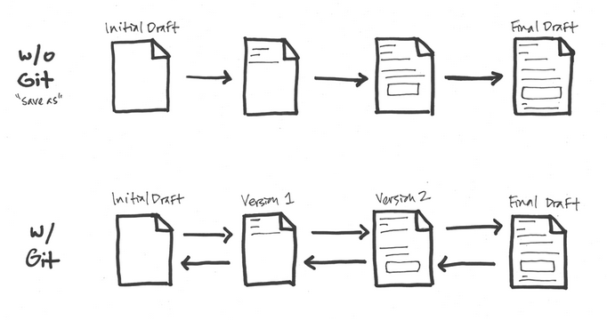
</div>
<!-- ----------------------- image --------------------------- -->

<footnote> [Creating and Hosting a Personal Site on GitHub](http://jmcglone.com/guides/github-pages/) </footnote>  
  
<!-- _____________________________ break ________________________________ -->
## Applications {.build}  

### **Version control**  

### Collaborate  

### Centralised storage of every possible file type, e.g. Supp Material    

### Dynamic loading of stored links and programs  

```{r echo=T, eval=F}
require(RCurl)
script <- getURL("https://raw.githubusercontent.com/darwinanddavis")
eval(parse(text = script))
```

### **Fork and clone a plethora of public data, code, material**    
  
<!-- _____________________________ break ________________________________ -->
## But why? {.build}  

### Reproducible    
### Unlimited    
### Transparent      
### Shareable      

<!-- _____________________________ break ________________________________ -->
## Why use the command line? {.build}    

### - Complete control and ease of workflow    
### - Transparent history    
### - Automate your commands, e.g. schedule an automatic daily backup      
### - A steeper learning curve, **but worth the investment**
    -> commands are few for benefits a many 

<!-- _____________________________ break ________________________________ -->
## Why use the command line (cont ...)? {.build}  
\  
\  
\  
```{bash}
telnet towel.blinkenlights.nl # watch movie in ascii  
```

<!-- _____________________________ break ________________________________ -->
## Workflow example {.build}   

### Open an `R` project with self-contained files    
### Use the `R Studio` in-built command line connected to your Github    
### Backup straight from `R`    
### _Cake!_  
git change  


<!-- _____________________________ break ________________________________ -->
## Best practice for git prep {.build}  

### Avoid spaces and CamelCase  
- e.g. 'my data.csv', 'My Data.csv' `POOR`  
- e.g. 'mydata.csv', 'my_data.csv' `GOOD`  

### Annotation    
```{r}
N <- 20 # set rep number  
p <- rep(rnorm(100),N) # repeat a random normal dist N times  
```
### _Tab_ is your friend    

<!-- _____________________________ break ________________________________ -->
# Let's git it    

<!-- _____________________________ break ________________________________ -->
## Initialising and using your repo {.build}  

### **1. Create a repo**  
### **2. Create and stage your files**  
#### - `add` and `commit` your files  
### **3. Push to a remote github repo**  
#### - `push` your files to your Github

<!-- _____________________________ break ________________________________ -->
## 1. Create a repo {.build}     

**Initialise your new local repo**
```{shell eval=F, echo=T}
# initialise your local git
### <b> 
git init  
### </b> 
```

<!-- _____________________________ break ________________________________ -->
## 2. Create and stage your files {.build}    

Add the files in your folder to the local git repo    
```{shell eval=F, echo=T}  
### <b> 
git add . # the '.' adds all files in your current directory  
### </b>
```

Stage the files for the commit   
```{shell eval=F, echo=T}  
### <b> 
git commit -m 'init commit' # -m adds a message  
### </b> 
```

### We've now added and staged files to a local repo. **Version control!**    

Let's check the changes    
```{shell eval=F, echo=T}
git log # recent git activity
git add test.txt # adds individual files  
git status # check what git is doing 
```

<!-- _____________________________ break ________________________________ -->
## 3. Push to a remote github repo {.build}    

Now we push the changes we made from our local repo to our Github cloud.  

1. Create a new Github repo. Name is using best practice, e.g. no spaces   
2. Don't create a README. Yet.  
- **Uncheck the box 'Initialise this Github with a README'.**

<!-- ----------------------- image --------------------------- -->
<div align="center">
  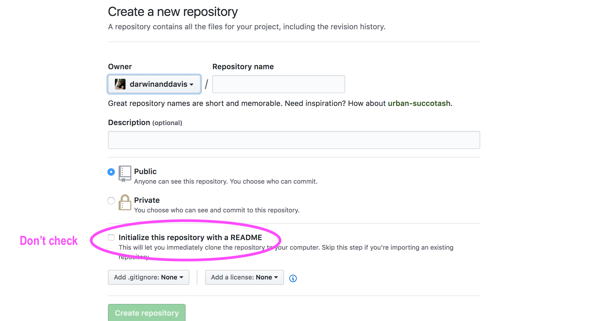
</div>
<!-- ----------------------- image --------------------------- -->

<!-- _____________________________ break ________________________________ -->
## 3. Push to a remote github repo (cont ...) {.build}    

First, copy the Github repo link you want to push to. Select either **https** or **SSH** (requires key access).        

<!-- ----------------------- image --------------------------- -->
<div align="center">
  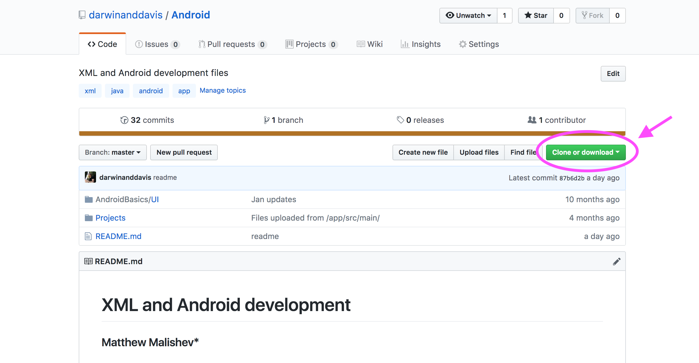
</div>
<!-- ----------------------- image --------------------------- -->

<!-- _____________________________ break ________________________________ -->
## 3. Push to a remote github repo (cont ...) {.build}  

Then push your staged (`commit`) files from your local repo to the remote repo  
```{shell eval=F, echo=T}  
# set the new remote repo
### <b>
git remote add origin "your github repo"  # if remote branch doesn't exist
### </b>
# see what remote repositories you have  
### <b>
git remote -v  
### </b>
# push changes to remote origin (github) from master branch (local)       
### <b>
git push origin master 
### </b>
```

<!-- _____________________________ break ________________________________ -->
# That's it! | Your data is now stored and version controlled <br> in local and remote repos    

<!-- _____________________________ break ________________________________ -->
# Cloning an existing repo {.flexbox .vcenter}   

<!-- _____________________________ break ________________________________ -->
## Clone a remote repo to your local computer {.build}

<!-- ----------------------- image --------------------------- -->
<div align="center">
  
</div>
<!-- ----------------------- image --------------------------- -->

<!-- _____________________________ break ________________________________ -->
## Clone a remote repo to your local computer (cont..) {.build}

This creates a git repository on your local machine complete with version control.  

Every version of every file for the history of the project is grabbed by default when you run `git clone`.  
```{shell echo=T, eval=F}
git clone "github url" "new repo name (optional)"
# e.g. git clone https://github.com/darwinanddavis/UsefulCode mynewrepo 
```

<!-- _____________________________ break ________________________________ -->
## Why clone? {.flexbox .vcenter .build}  

### You can dump the contents of any public repo, including its complete version history, onto your own computer, then upload it onto the cloud.

<div align="center">
  
</div>

<!-- _____________________________ break ________________________________ -->
## Workflow example {.build}     

### Open an '.Rproj' with self-contained files    
### Use the `R Studio` in-built command line connected to your Github      
### Backup straight from `R`      
### _Cake!_          

<!-- _____________________________ break ________________________________ -->
## Open an '.Rproj' with self-contained files {.build}  

Open `RStudio`    
  
_File_ >   
_New Project_ >   
_New Directory_ >   
_New Project_ >   
_Create a git repository_    

<!-- _____________________________ break ________________________________ -->
## Use the `R Studio` in-built command line {.build}  

Create your `R` file/s  
_File_ >  
_New file_  

File options:   
[Using RMarkdown](https://rmarkdown.rstudio.com/)    
[Shiny web app](https://shiny.rstudio.com/)    
[R Presentation](https://support.rstudio.com/hc/en-us/articles/200486468-Authoring-R-Presentations)    

<!-- _____________________________ break ________________________________ -->
## Run your `git` commands from `R` terminal  {.build}      

<div align="center">
  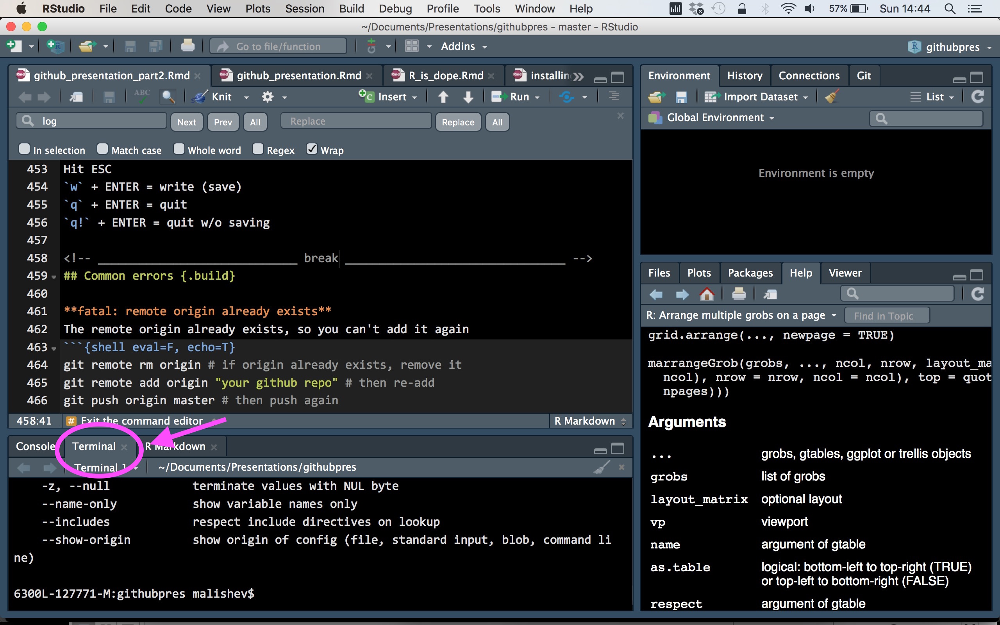
</div>

<!-- _____________________________ break ________________________________ -->
## One more option {.build}   

1. Go to GIT menu in `RStudio`  

<div align="center">
  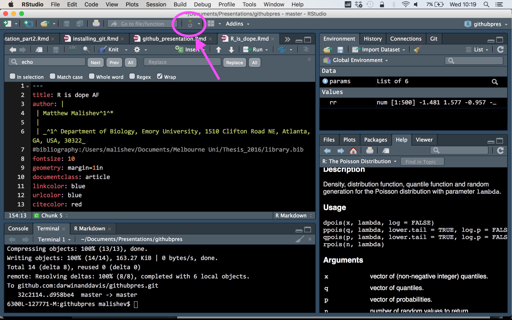
</div>

<!-- _____________________________ break ________________________________ -->  
## Examples of my workflow {.build}    

- Useful Code repo and README.md file  

<!-- _____________________________ break ________________________________ -->  
##  

<!-- ----------------------- image --------------------------- -->
<div align="center">
  
</div>
<!-- --------------------------------------------------------- -->

<!-- _____________________________ break ________________________________ -->
##  

<!-- ----------------------- image --------------------------- -->
<div align="center">
  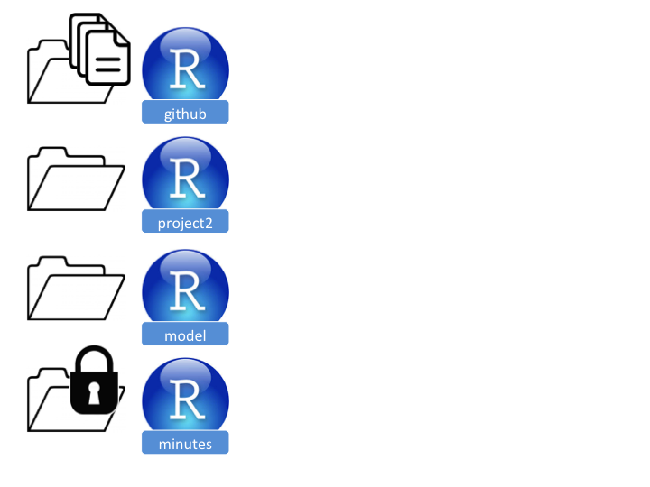
</div>
<!-- --------------------------------------------------------- -->

<!-- _____________________________ break ________________________________ -->
##  

<!-- ----------------------- image --------------------------- -->
<div align="center">
  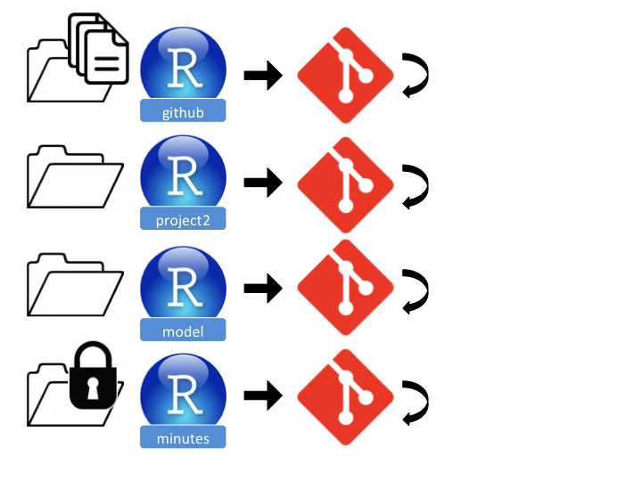
</div>
<!-- --------------------------------------------------------- -->

<!-- _____________________________ break ________________________________ -->
##  

<!-- ----------------------- image --------------------------- -->
<div align="center">
  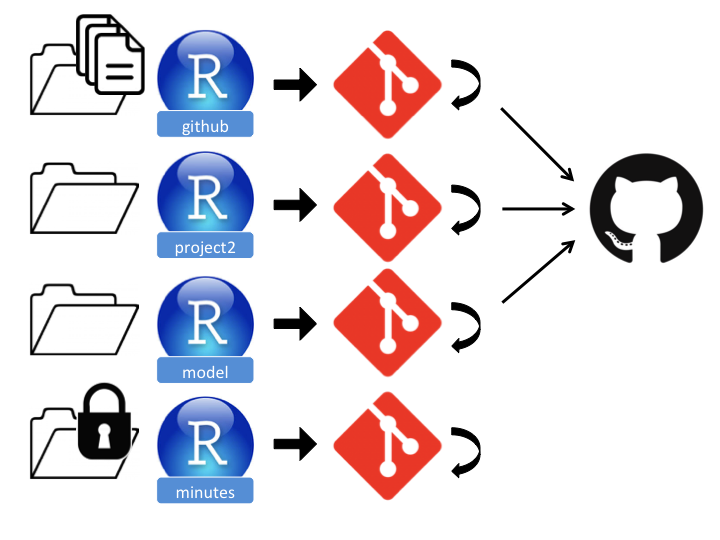
</div>
<!-- --------------------------------------------------------- -->  

<!-- _____________________________ break ________________________________ -->
##  

<!-- ----------------------- image --------------------------- -->
<div align="center">
  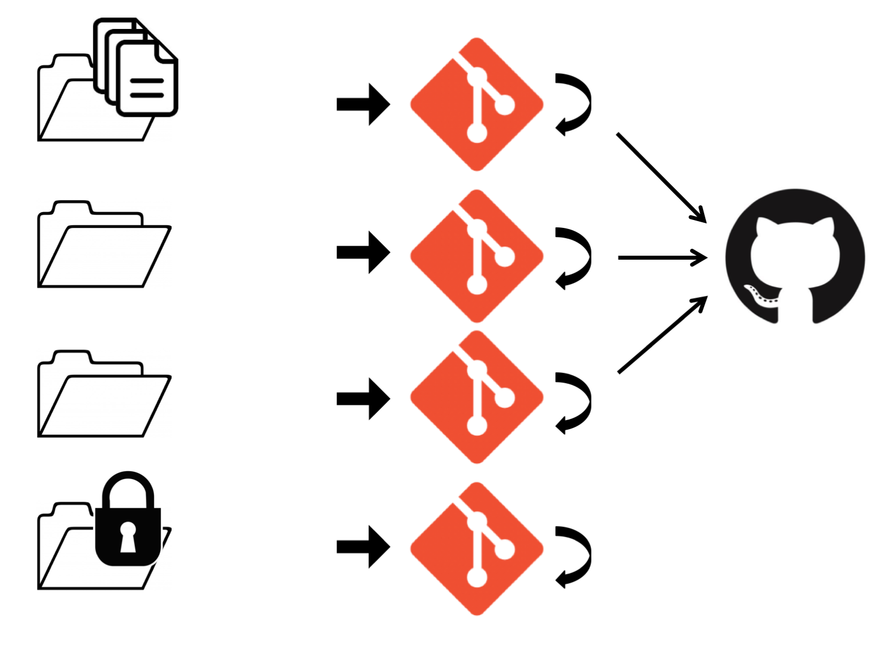
</div>
<!-- --------------------------------------------------------- -->

<!-- _____________________________ break ________________________________ -->  
# Using the README file {.flexbox .build}  

<!-- _____________________________ break ________________________________ -->  
## README Option 1 {.build}  

You **unchecked** the 'Initialise with a README' option on Github        

Your active local repository    
```{shell, eval=F, echo=T}  
git init # initialise local repo  
git remote add origin "your Github repo"  # add Github repo (remote = cloud)  
```

Create a README using a text editor, e.g. Sublime (md = Markdown)      
```{shell, eval=F, echo=T}  
git add README.md # stage the readme file 
git commit -m 'readme' # commit the git  
git push origin master # push the changes to your Github  
```

<!-- _____________________________ break ________________________________ -->  
## README Option 2 {.build}  

You **checked** the 'Initialise with a README' option on Github 

Your active local repository    
```{shell, eval=F, echo=T}  
git init # initialise local repo  
git remote add origin "your Github repo"  # add Github repo (remote = cloud)  
```

Pull the new change (a commit) that you made to the repo by initialising the README        
```{shell, eval=F, echo=T}  
git pull origin master # pull the readme file change from Github   
git push --set-upstream origin master # push the changes to your Github  
```
  
Check git status
```{shell, eval=F, echo=T}  
git status # check git status
```

<!-- _____________________________ break ________________________________ -->  
## The time `git` schooled me {.build}        

1. Accidently uploaded my Google API to Github    

2. Github emailed me with a warning  

3. I deleted all the instances of the API, but git tracked it  

4. Deleted the Github repo completely to remove evidence    

5. Pushed the local files to the new repo ... _with all its current git history_    

<!-- ----------------------- image --------------------------- -->
<div align="center">
  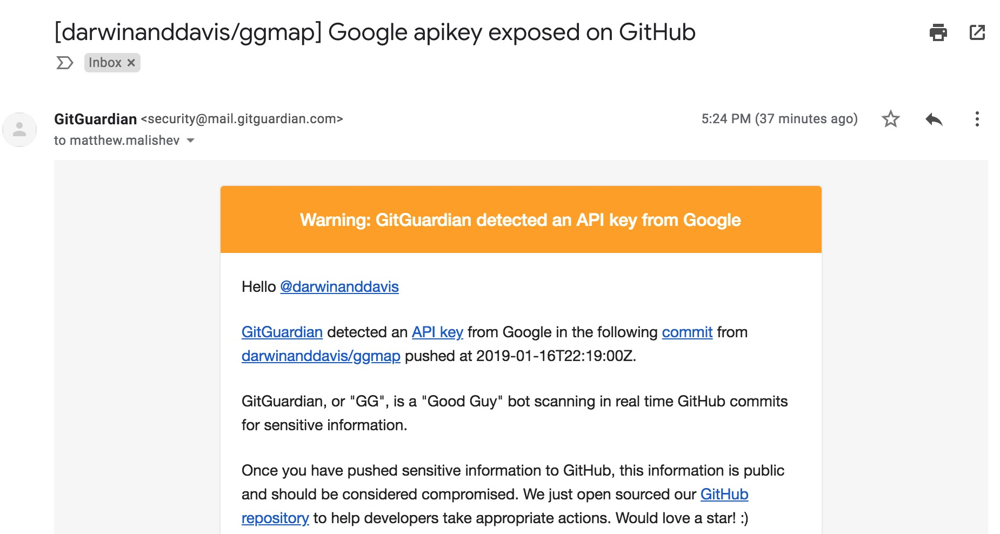
</div>
<!-- --------------------------------------------------------- -->

<!-- _____________________________ break ________________________________ -->
## `gitignore` files {.build}  

<!-- ----------------------- image --------------------------- -->
<div align="center">
  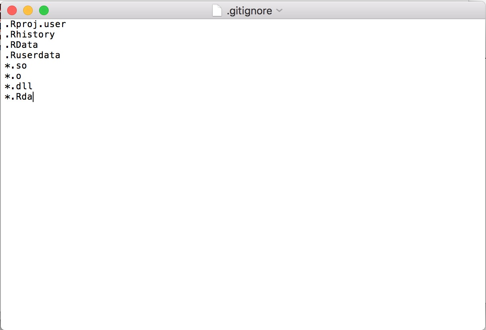
</div>
<!-- ----------------------- image --------------------------- -->
  
Type the following in Terminal/R  
```{shell eval=F, echo=T}
ls -a # lists current dir contents   
touch .gitignore  # create a gitignore if not already
open .gitignore # open the gitignore file    
git status --ignored # list what is being ignored 
```

<!-- _____________________________ break ________________________________ -->
## The short version {.build}    

### local git (version control on your comp)  
```{shell eval=F, echo=T}
git init # initialise your local git  
git add . # adds all files to git. replace '.' with filename for individ files
git commit -m 'redo intro' # '-m' = message 
```

### remote git (version control on your github)  
```{shell eval=F, echo=T}
# after the above steps ^ 
# see what remote repo you have. if a github exists, you can push
git remote -v  
# set the new remote repo (if necessary)  
git remote add origin "your github repo"  # if remote branch doesn't exist
git remote set-url origin "your github repo"  # if already exists
# push changes from local repo to remote repo 
git push 
```

### **If in doubt, ask the internet**    

<!-- _____________________________ break ________________________________ -->
# Troubleshooting  

<!-- _____________________________ break ________________________________ -->
## Useful `git` syntax {.build}  

```{shell, eval=F}
git config --global user.name "Matt Malishev"
git config --global user.email "mmlshv@gmail.com" 

```

`git diff`  
```{shell, eval=F}
git diff # print differences (changes) to files  
git diff --stage # show changes in staged gits 
```

Extra flags for git commands  
```{shell, eval=F}
git log --online # condense log into one line summary  
```


<!-- _____________________________ break ________________________________ -->
## Useful `shell` syntax {.build}     

change working dir to 'Documents'  
`cd ~/Documents`    

move one level up    
`cd ..`   

print current working dir      
`pwd`   

list files in working dir      
`ls`   

make new working dir    
`mkdir newfolder`   

create new file   
`touch text.txt`   

<!-- _____________________________ break ________________________________ -->
## More useful syntax {.build}    

copy files from _source_ to _destination_. e.g. cp /Users/mydir/README.txt ~/Documents    
`cp source destination`      

copy all folders, subfolders, and files from _source_ to _destination_    
`cp -R source destination`    

move files or folders from _source_ to _destination_ (no need for `-R`)    
`mv source destination`    

move multiple files with the * wildcard, which copies all .rtf files. The tilde (~) symbol is a shortcut for your Home folder, which contains '/Desktop'.      
`cp ~/Desktop/*.rtf ~/Documents`    

rename files      
`mv ~/Desktop/MyFile.rtf ~/Desktop/MyFile-old.rtf`    
`cp ~/Desktop/MyFile.rtf ~/Documents/MyFile-old.rtf`    

<!-- _____________________________ break ________________________________ -->
## Exit the command editor {.build}    
  
**Exiting command editor**    
Write your message at the top of the editor, then run the following:  
  
    
      
Hit ESC   
`:` = opens editor    
`w` + ENTER = write (save)  
`q` + ENTER = quit  
`q!` + ENTER = quit w/o saving  

<!-- _____________________________ break ________________________________ -->
## Exit the command editor (cont..) {.build}  

Example  
```{shell, eval=F, echo=T}
readme # enter message
```

Type `:wq`, then press ENTER.    

Nano:  
Press Control+O (the letter, not 0 the number), then Enter to save the message. Then, press Control+X to exit.  

Vim:  
Press Escape and then type :wq and press Enter.  

<!-- _____________________________ break ________________________________ -->
## Common errors {.build}       

**fatal: remote origin already exists**  
The remote origin already exists, so you can't add it again
```{shell eval=F, echo=T}  
git remote rm origin # if origin already exists, remove it
git remote add origin "your github repo" # then re-add 
git push origin master # then push again  
```

**! [rejected] master -> master (non-fast-forward)**
Someone else has made changes since your latest ones and git refuses to lose the commit, so won't push your new changes  
```{shell eval=F, echo=T}  
git pull origin master # fetches any updates to online repo and merges them    
```

<!-- _____________________________ break ________________________________ -->
## Common errors (cont ...) {.build}     

**fatal: refusing to merge unrelated histories**
Usually associated with a README file on the Github repo  
```{shell eval=F, echo=T}  
git pull origin master --allow-unrelated-histories # unnecessary parallel history 
# merged to your project. usually associated with a README.md file
```
If VIM opens, type 'SHIFT + :', then press ENTER  

**fatal: The current branch master has no upstream branch**    
```{shell eval=F, echo=T}  
git push --set-upstream origin master
```

<!-- _____________________________ break ________________________________ -->
## Weird technical errors {.build}  

**invalid active developer path** (Mac OSX and XCode issue)    
xcrun: error: invalid active developer path (/Library/Developer/CommandLineTools), missing xcrun at: /Library/Developer/CommandLineTools/usr/bin/xcrun    
```{shell}
xcode-select --install # install missing xcode developer tools
xcode-select --reset # if above install doesn't work, reset xcode 
```

<!-- _____________________________ break ________________________________ -->
## Staging and pushing files {.build} 

Re-do a commit    
```{shell eval=F, echo=T}
git reset --soft HEAD~1
```

Alternative push option 
```{shell eval=F, echo=T}
# option 1
git remote set-url origin "link to existing github repo" # talk to github 
git push -u origin master
# option 2
git remote add github "your github repo"  # if remote branch doesn't exist
git push -u github master
```

<!-- _____________________________ break ________________________________ -->
## Staging and pushing files (cont ...) {.build} 

After pushing to your remote repo and this error appears:  
` ! [rejected] master -> master (fetch first)`
```{shell eval=F, echo=T}   
git fetch origin master # match the local repo commit status to the push destination     
git merge master # merge the recent commits    
git push -u origin master # push to remote repo  

# ------- for non-fast-forward error  ---------
# grab changes made on remote repo and align with local master branch 
git fetch origin master:tmp  
git rebase tmp
git push origin HEAD:master # push the changes from local HEAD to remote    
git branch -D tmp
git push -u origin master # finalise the changes  
```

<!-- _____________________________ break ________________________________ -->
## Staging and pushing files (cont ...) {.build} 

For `fatal: refusing to merge unrelated histories` error  
```{shell eval=F, echo=T}   
git checkout master
git merge origin/master --allow-unrelated-histories
# or run this before your 'git pull origin master' command  
git pull --allow-unrelated-histories origin master 
```

Delete files from remote repo (option 1)   
```{shell eval=F, echo=T}
git rm --cached file1.txt
git commit -m "remove file1.txt"
git push
```

<!-- _____________________________ break ________________________________ -->
## Staging and pushing files (cont ...) {.build}   

Delete files from a Github repo (option 2)
```{shell eval=T, echo=T}
# ensure you are in the default branch:
git checkout master
# the rm -r command will recursively remove your folder:
git rm -r folder-name
#Commit the change:
git commit -m "Remove duplicated directory"
# push the change to your remote repo
git push origin master
```

<!-- __________________________ break _______________________________ -->
## Accessibility  {.build}  

If Github questions your user credentials.      
```{shell eval=F, echo=T}
git config --global user.email "<your email>" 
git config --global user.name "<your github user name>" 
```

Cache your user credentials to avoid being asked everytime  
```{shell eval=F, echo=T}
# once in git directory   
git config credential.helper store  
```

<!-- __________________________ break _______________________________ -->
## Accessibility (cont ...)  {.build}  

When using SSH for your github remote repo, e.g. `git@github.com:username/reponame.git` 

[Generating a new SSH key](https://help.github.com/articles/generating-a-new-ssh-key-and-adding-it-to-the-ssh-agent/)  

Accessing your SSH key:  

- In Mac, in _Terminal_, type   
```{shell eval=F, echo=T}
cat ~/.ssh/id_rsa.pub  
```
- In Windows, in _cmd_, type   
```{shell eval=F, echo=T}
ls ~/.ssh/*.pub   
```

<!-- __________________________ break _______________________________ -->
## Accessibility (cont ...)  {.build}  

Use a custom command line editor  
  
  
[Use your own editor for running git commands](https://stackoverflow.com/questions/2596805/how-do-i-make-git-use-the-editor-of-my-choice-for-commits/2596835#2596835)  

Some examples:  
Nano  
Vim  
Sublime  

<!-- _____________________________ break ________________________________ -->
## Accessing commits {.build}    

[How to undo anything with Git](https://blog.github.com/2015-06-08-how-to-undo-almost-anything-with-git/)    

[How to access recent commits to your local repo](https://stackoverflow.com/questions/4114095/how-to-revert-a-git-repository-to-a-previous-commit)  

```{shell eval=F, echo=T}
git log # check recent activity and select commit e.g. 0df4g3 ...  
git checkout "enter your commit tag" # e.g. 50577c90  
git checkout master  # return to current branch 
```

```{shell, eval=F, echo=T}  
git revert HEAD~3 # revert back 3 commits 
```

To revert everything from the HEAD (current stage) back to the commit hash  
```{shell eval=F, echo=T}
git revert --no-commit 0766c053..HEAD # replace 0766c053 with your commit tag
git commit
```


<!-- _____________________________ break ________________________________ -->
## Creating automatic commits/push commands {.build} 

1. Install `fswatch` https://github.com/emcrisostomo/fswatch (requires [Homebrew package manager](https://brew.sh/) for Max OSX).  

2. Create a script for the commit and push (auto_commit_push.sh)  

```{shell eval=F, echo=T}  
#!/bin/bash
# <<branch>> = branch you are pushing to
git commit -m "auto commit" $1 
git push origin <<branch>> 
```

<!-- _____________________________ break ________________________________ -->
## Creating automatic commits/push commands (cont ...) {.build} 

3. In Terminal, navigate to your folder with the git  
```{shell eval=F, echo=T}  
# <<file>> = file you want to monitor
# <<path/to/auto_commit_push.sh>> = path to the script created above
fswatch -0 <<file>> | xargs -0 -n 1 bash <<path/to/auto_commit_push.sh>>
```

4. Keep the `fswatch` command still active in a separate shell, do whatever you want and when monitored file is updated, it will automatically be committed and pushed.      

<!-- _____________________________ break ________________________________ -->
## References  

[Generating a new SSH key](https://help.github.com/articles/generating-a-new-ssh-key-and-adding-it-to-the-ssh-agent/)    

[How to undo anything with Git](https://blog.github.com/2015-06-08-how-to-undo-almost-anything-with-git/)    

[How to access recent commits to your local repo](https://stackoverflow.com/questions/4114095/how-to-revert-a-git-repository-to-a-previous-commit)

[Origin master - rejected (fetch first), no file in GitHub repository](https://stackoverflow.com/questions/46619527/gitbash-origin-master-rejected-fetch-first-no-file-in-github-repository)    

[Intro to git: Branches, pull requests, and other useful stuff](https://product.hubspot.com/blog/git-and-github-tutorial-for-beginners)

[Git - the simple guide](http://rogerdudler.github.io/git-guide/)    

[Automatically push an updated file whenever it is changed](https://gist.github.com/darencard/5d42319abcb6ec32bebf6a00ecf99e86)     

<!-- _____________________________ break ________________________________ -->
## References (cont ...)  

[Using Github pages](https://stackoverflow.com/questions/15563685/can-i-create-more-than-one-repository-for-github-pages)  

[Using RMarkdown](https://rmarkdown.rstudio.com/)  

[Shiny web app](https://shiny.rstudio.com/)  

[Authoring R presentations](https://support.rstudio.com/hc/en-us/articles/200486468-Authoring-R-Presentations)  

<!-- _____________________________ break ________________________________ -->
## References (cont ...)  

[invalid active developer path (xcrun: error: invalid active developer path)](https://apple.stackexchange.com/questions/254380/why-am-i-getting-an-invalid-active-developer-path-when-attempting-to-use-git-a)    

[How to revert a Git repository to a previous commit](https://stackoverflow.com/questions/4114095/how-to-revert-a-git-repository-to-a-previous-commit)  

[Using the README file on Github](https://stackoverflow.com/questions/23304688/issue-pushing-to-a-github-repository-created-with-initialize-repo-with-a-readme)      

<!-- _____________________________ BODY ________________________________ -->
<!-- ____________________________________________________________________ -->

