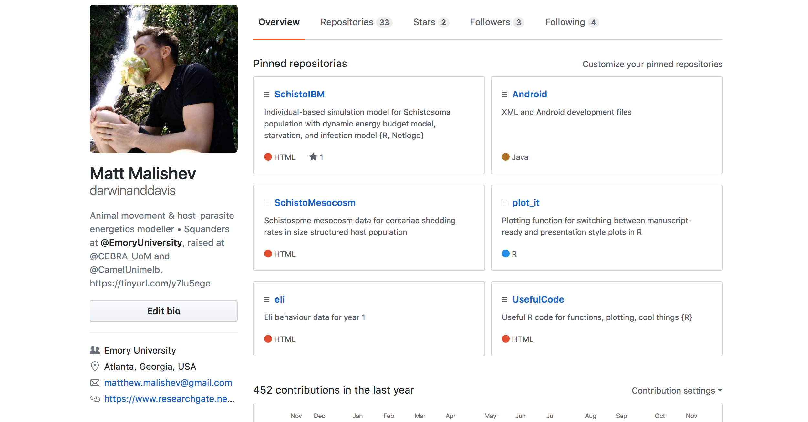
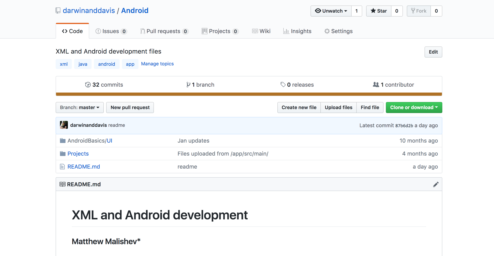
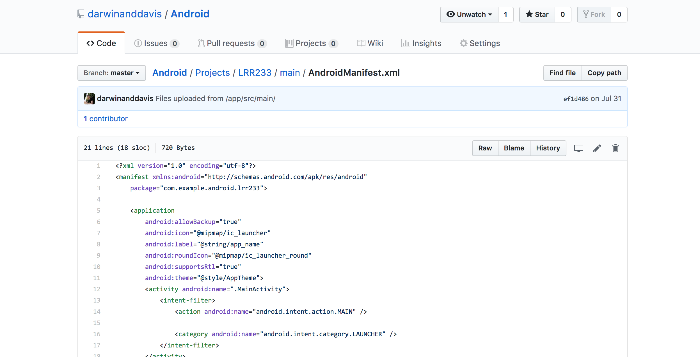
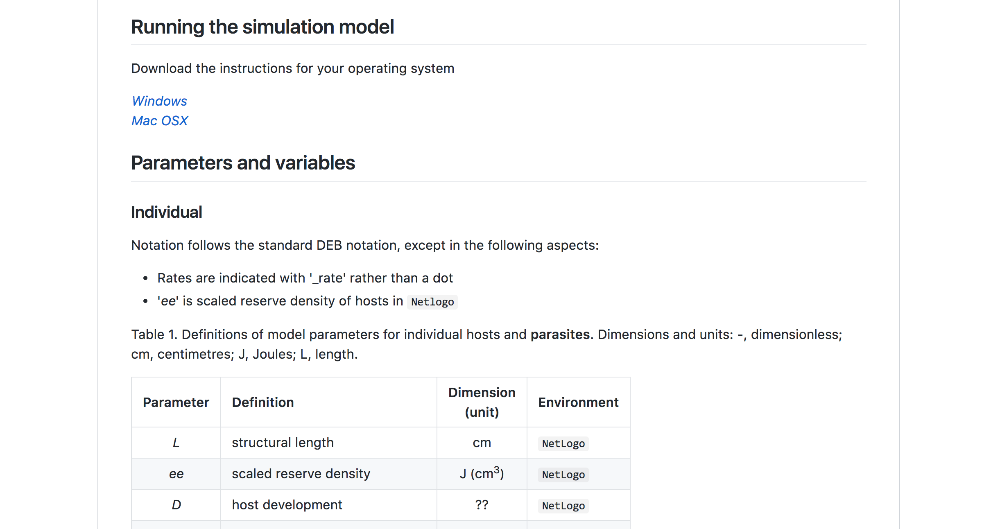

<script type="text/x-mathjax-config">
  MathJax.Hub.Config({ TeX: { equationNumbers: {autoNumber: "all"} } });
</script>

```{r echo = FALSE}
# library(rmarkdown)
# setwd("")
# f <- list.files()[1]
# render(f, output_format='pdf_document')
```

```{r, set-options, echo = FALSE, cache = FALSE}
options(width=100)
knitr::opts_chunk$set(
 eval = TRUE, # run all code
 # echo = FALSE, # show code chunks in output 
 comment = "",
 tidy.opts=list(width.cutoff=100), # set width of code chunks in output
 tidy=TRUE, # make output as tidy
 message = FALSE,  # mask all messages
 warning = FALSE, # mask all warnings 
 size="small" # set code chunk size
)

# https://github.com/ucb-stat133/stat133-fall-2016/blob/master/hws/hw02-tables-ggplot.Rmd
knitr::opts_knit$set(root.dir=paste0(params$dir,"/")) # set working dir

setwd(paste0(params$dir,"/")) # for running just in R not knitr
```

\newpage   

Date: `r params$date`  
R version: `r params$version`  
*Corresponding author: `r params$email`  
This document can be found at `r params$doi`  
\newpage    

## Install git  

**Mac users**  
[Install git](https://git-scm.com/book/en/v2/Getting-Started-Installing-Git).      

**Windows users**  
[Install git with Git Bash](https://www.sitereq.com/post/easiest-way-to-install-git-bash-commands-on-windows#git-bash-windows-installation). Git Bash is a text editor for running git commands.      

Once git is on your computer, you can now access its features using either just your local computer for version control or your Github account for version control on the cloud.    

## Create a Github account    

[Create your new Github account](https://github.com/). Some tips on creating an account:  

- Choose a username that you plan to keep. Something that represents your professional acumen, e.g. not "matt_loves_hiphop86"  
\  
- Github is universal and really useful. You can connect to programming, troubleshooting, userX sites, and coding libraries, e.g. CodePen, using your Github account, so plan for longevity.  
\  

Feel free to navigate my personal Github page. Everything is publicly available. 

[www.github.com/darwinanddavis](www.github.com/darwinanddavis)       

Some essential elements of your Github page:  

- Your repositories. This is where you store your online information.    
\  
- Your gits. These are the digital footprints of your changes. We use this for [version control](https://git-scm.com/book/en/v2/Getting-Started-About-Version-Control).    
\  
- Your README.md file. This tells users what your repo contains, instructions for running code, troubleshooting, version control, links to external web sources, and other git specific elements, such as program/package versions.  
\  

\newpage  

Here are some screenshots of what you'll see on your own github page.  

  

  

  

   
\  
**End installation instructions.** The following sections contain reference guides for using git and bash commands (talking to git). Familiarise yourself with these beforehand.    

******  

\newpage     

## Resources and references  

This section contains useful syntax and references for using git. We'll be using the command line to talk with git.   

- In Mac, this is found in _Applications > Terminal_.  
- In Windows, open the **Git Bash** application.  

### Commmon `git` syntax       
**Note: commands require spaces between terms.**  

Common `git` phrases       

*init* = initialise your git  
*push* = push your changes to a remote repository  
*pull* = pull changes made remotely to match local git changes  
*fetch* = re-align git changes from origin (remote) to master (local) branch  


Configure your credentials  
```{bash eval=F, echo=T}
git config --global user.name "<your name>"
git config --global user.email "<your email>"  
```


initialise a new git (local)     
```{bash eval=F, echo=T}
git init  
```

add all files in directory to git (local)     
```{bash eval=F, echo=T}
git add .
```

add individual file (local)     
```{bash eval=F, echo=T}
git add abstract.txt
```

check git activity  (local)  
```{bash eval=F, echo=T}
git status 
``` 

add remote origin source to push git (remote)
```{bash eval=F, echo=T}
# two options  
get remote set-url origin https://github.com/darwinanddavis/newtest.git  
git remote add origin https://github.com/darwinanddavis/newtest.git
```

push git changes to origin (your remote location) from your master (local) branch         
```{bash eval=F, echo=T}
git push origin master 
```

check latest git activity (local) 
```{bash eval=F, echo=T}
git log
```

check what remote locations you have available to push your gits  
```{bash eval=F, echo=T}
git remote -v # v = verbose    
```

add another remote destination (on github) called 'github' (remote) and push your staged git (file changes) to that remote location from your master (local) branch      
```{bash eval=F, echo=T}
git remote add github https://github.com/darwinanddavis/newtest.git 
git push github master 
```

See these references for a brief intro to using the command line in [Mac](https://macpaw.com/how-to/use-terminal-on-mac) and [Windows](https://www.computerhope.com/issues/chusedos.htm).    

\  

### Useful command line syntax  
**Note: commands require spaces between terms.**    

`cd ~/Documents` change working dir to 'Documents'. `cd ..` move one level up

`pwd` print current working dir    

`ls` list files in working dir    

`mkdir newfolder` make new working dir  

`touch text.txt` create new file (called text.txt)  

### More useful syntax  
**Note: commands require spaces between terms.**  

copy files from _source_ to _destination_. e.g. cp /Users/mydir/README.txt ~/Documents    
`cp source destination`      

copy all folders, subfolders, and files from _source_ to _destination_    
`cp -R source destination`    

move files or folders from _source_ to _destination_ (no need for `-R`)    
`mv source destination`    

move multiple files with the * wildcard, which copies all .rtf files. The tilde (~) symbol is a shortcut for your Home folder, which contains '/Desktop'.      
`cp ~/Desktop/*.rtf ~/Documents`    

rename files      
`mv ~/Desktop/MyFile.rtf ~/Desktop/MyFile-old.rtf`    
`cp ~/Desktop/MyFile.rtf ~/Documents/MyFile-old.rtf`   

### Example of command line workflow  
**Install 'gitbash' to use Linux/Mac capabilities if not already**     


Open _Terminal/cmd_       
```{bash eval=F, echo=T}
cd ~/Documents/ # change working dir
ls # list dir contents      
``` 

Open _Finder/Windows_. Make a new project on your local comp.  
```{bash eval=F, echo=T}
# create new project  
### <b> 
cd ~/Documents
### </b>
# create new file 
### <b> 
touch test.txt  
open test.txt  
### </b> 
# make a new folder  
### <b> 
mkdir newgit  
### </b>
# navigate to that folder  
### <b>
cd newgit
ls -a  
### </b>   
```

Create a new file in the command line       
```{bash eval=F, echo=T}
# navigate to your new git repo  
### <b>
pwd  
cd ~/Documents/newgit
### </b> 

# move the new file into the git repo      
### <b> 
mv ~/Documents/test.txt ~/Documents/newgit
ls  
### </b> 
```
  
## References  
[Installing git](https://git-scm.com/book/en/v2/Getting-Started-Installing-Git)  

[Sign up to Github](https://github.com/)    

[Version control with git](https://git-scm.com/book/en/v2/Getting-Started-About-Version-Control)      

[Terminal in Mac](https://macpaw.com/how-to/use-terminal-on-mac)    

[Command line in Windows](https://www.computerhope.com/issues/chusedos.htm)    

[]() 

## Maintainer  
Matt Malishev  
[Github](https://github.com/darwinanddavis) | [Website](https://www.researchgate.net/profile/Matt_Malishev)  
matthew.malishev [at] emory.edu  

  


